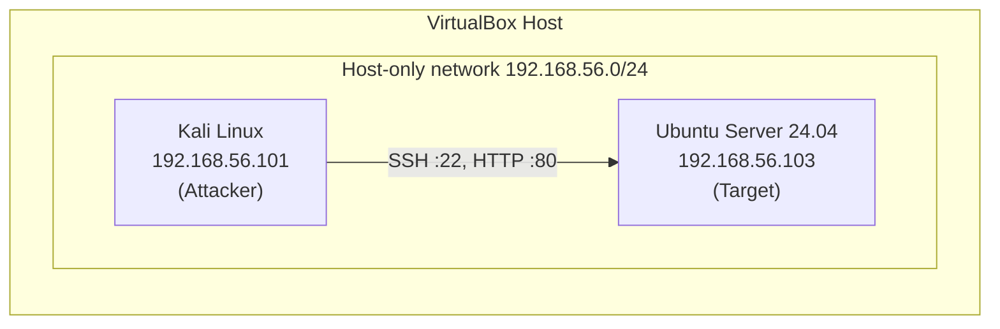

# CSO7018 Ethical Hacking — Final Assessment Artefact

Student ID: 2416509  
Assessment: Controlled penetration testing lab engagement  
Target: Ubuntu Server 24.04 LTS · Attacker: Kali Linux

---

## Overview

This repository contains the complete submission artefact for a controlled penetration test performed in an isolated VirtualBox lab. The engagement follows a standard assess–remediate–retest workflow: lab validation, vulnerability discovery on SSH and Apache, defensive hardening, and post-mitigation verification.

All activity was confined to a host-only network. No external or production systems were targeted.

---

## Lab Topology



| Role | VM | IP address | Assessed services |
|------|-----|------------|-------------------|
| Attacker | Kali Linux | `192.168.56.101` | — |
| Target | Ubuntu Server 24.04 LTS | `192.168.56.103` | SSH (22), Apache HTTP (80) |

See [Fig00](Evidence/00_Topology/Fig00_Lab_Topology.png) for the full topology diagram.

---

## Engagement Summary

| Phase | Scope | Figures | Outcome |
|-------|-------|---------|---------|
| 1. Lab setup & validation | Connectivity, service checks, Nmap discovery | Fig01–Fig07 | SSH and Apache confirmed reachable |
| 2. Finding 1 — SSH weak authentication | Credential testing with Hydra | Fig08–Fig11 | Weak credential `testuser:password123` discovered |
| 3. Finding 2 — Apache information disclosure | Header analysis, Nikto, DIRB, log review | Fig12–Fig16 | Version disclosure and missing security headers |
| 4. Finding 2 mitigation & retest | Apache hardening, curl/Nikto retest | Fig17–Fig23 | Reduced disclosure; security headers applied |
| 5. Finding 1 mitigation & retest | Strong password, Fail2Ban, Hydra retest | Fig24–Fig30 | Brute-force attack unsuccessful after remediation |

---

## Findings

### Finding 1 — Weak SSH authentication

| | |
|---|---|
| Risk | Predictable credentials allow unauthorised remote shell access |
| Discovery | Hydra brute-force against `testuser` ([Fig10](Evidence/02_Finding_1_SSH_Weak_Authentication/Fig10_Hydra_Credential_Discovery.png)) |
| Evidence | Successful login ([Fig08](Evidence/02_Finding_1_SSH_Weak_Authentication/Fig08_SSH_Login_Success.png)), auth logs from attacker IP ([Fig11](Evidence/02_Finding_1_SSH_Weak_Authentication/Fig11_SSH_Authentication_Logs.png)) |
| Mitigation | Strong password policy ([Fig28](Evidence/05_Finding_1_SSH_Mitigation_Retest/Fig28_Strong_Password_Verification.png)), Fail2Ban `sshd` jail ([Fig25–Fig27](Evidence/05_Finding_1_SSH_Mitigation_Retest/)) |
| Retest | Hydra returned 0 valid passwords ([Fig30](Evidence/05_Finding_1_SSH_Mitigation_Retest/Fig30_Hydra_Retest_After_Mitigation.png)) |

### Finding 2 — Apache information disclosure

| | |
|---|---|
| Risk | Server version and missing headers aid attacker reconnaissance |
| Discovery | `curl -I`, Nikto, DIRB enumeration ([Fig12–Fig14](Evidence/03_Finding_2_Apache_Enumeration/)) |
| Evidence | `Server: Apache/2.4.66 (Ubuntu)` in headers, access/error log entries ([Fig15–Fig16](Evidence/03_Finding_2_Apache_Enumeration/)) |
| Mitigation | `ServerTokens Prod`, `ServerSignature Off`, `TraceEnable Off`, custom security headers — see [Configurations/hardening_notes.md](Configurations/hardening_notes.md) |
| Retest | Reduced server banner and Nikto findings ([Fig22–Fig23](Evidence/04_Finding_2_Apache_Mitigation_Retest/)) |

---

## Repository Structure

```
CSO7018_Ethical_Hacking_Artefact_2416509/
├── Final_Report_2416509.docx          # Main written report (Fig00–Fig30 embedded)
├── Evidence_Index_2416509.md          # Full figure register with captions
├── README.md                          # This file
├── Evidence/
│   ├── 00_Topology/                           Fig00
│   ├── 01_Lab_Setup_and_Service_Validation/   Fig01–Fig07
│   ├── 02_Finding_1_SSH_Weak_Authentication/  Fig08–Fig11
│   ├── 03_Finding_2_Apache_Enumeration/       Fig12–Fig16
│   ├── 04_Finding_2_Apache_Mitigation_Retest/   Fig17–Fig23
│   └── 05_Finding_1_SSH_Mitigation_Retest/    Fig24–Fig30
├── Scripts/
│   └── commands_used.md               # Reproducible command reference
└── Configurations/
    └── hardening_notes.md             # Apache mitigation summary
```

---

## Quick Navigation

| Document | Purpose |
|----------|---------|
| [Final_Report_2416509.docx](Final_Report_2416509.docx) | Full narrative report with embedded figures |
| [Evidence_Index_2416509.md](Evidence_Index_2416509.md) | Figure filenames, sections, and captions (Fig00–Fig30) |
| [Scripts/commands_used.md](Scripts/commands_used.md) | All commands used during the engagement |
| [Configurations/hardening_notes.md](Configurations/hardening_notes.md) | Apache hardening controls applied |

---

## Tools Used

| Category | Tools |
|----------|-------|
| Reconnaissance | `nmap`, `ping`, `ss` |
| SSH testing | `ssh`, Hydra, `journalctl` |
| Web enumeration | `curl`, Nikto, DIRB |
| Defensive controls | Apache `security.conf`, Fail2Ban |

Command syntax and execution order are documented in [Scripts/commands_used.md](Scripts/commands_used.md).

---

## Ethical Scope & Rules of Engagement

- Testing was performed only on VMs in an isolated VirtualBox host-only network (`192.168.56.0/24`).
- The weak `testuser` account was created deliberately for controlled credential testing.
- No denial-of-service, data exfiltration, or testing outside the defined scope was performed.
- All screenshots are from the lab environment and support reproducibility of findings.

Do not run the attack commands in this repository against systems you do not own or have explicit written permission to test.

---

## Submission Checklist

- [ ] `Final_Report_2416509.docx`
- [ ] This artefact folder (zip if required by the module), including:
  - [ ] `Evidence/` (31 screenshots, Fig00–Fig30)
  - [ ] `Evidence_Index_2416509.md`
  - [ ] `Scripts/commands_used.md`
  - [ ] `Configurations/hardening_notes.md`
  - [ ] `README.md`

---

## Reproducing the Lab

1. Deploy Kali Linux and Ubuntu Server 24.04 on a VirtualBox host-only adapter (`192.168.56.0/24`).
2. Assign static IPs: Kali `192.168.56.101`, Ubuntu `192.168.56.103`.
3. Enable SSH and Apache on the Ubuntu target.
4. Follow the phased commands in [Scripts/commands_used.md](Scripts/commands_used.md), capturing evidence at each step as referenced in [Evidence_Index_2416509.md](Evidence_Index_2416509.md).
